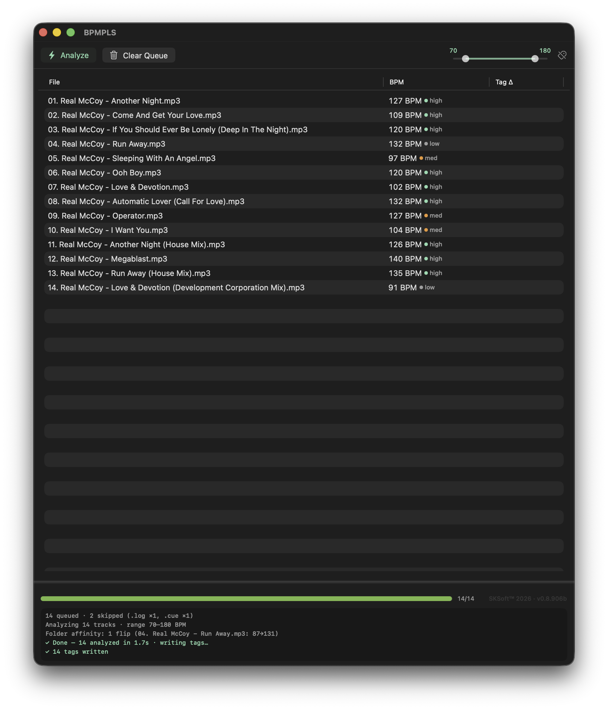

# BPMPLS — BPM analyzer & tagger for Mac

BPMPLS — "BPM, please" — is a free, open-source BPM analyzer for Mac: batch tempo detection and in-place BPM tagging for MP3 and FLAC, built for DJs. Drag a folder in, get honest tempos written straight into your files.

macOS 14+, Apple Silicon and Intel (universal binary), no dependencies, no accounts, no telemetry.

<p align="center"></p>

## Download

**[BPMPLS-0.8.906c-universal.dmg](https://github.com/skseq/BPMPLS/releases/download/v0.8.906c/BPMPLS-0.8.906c-universal.dmg)** — free, macOS 14+, Apple Silicon and Intel. The app is unsigned: on first launch, confirm via **System Settings ▸ Privacy & Security ▸ Open Anyway**. All releases [here](https://github.com/skseq/BPMPLS/releases); or build from source with `./build.sh`.

## What it does

- **Drop files or folders** — recursive scan queues every `.mp3` / `.flac` it finds and tells you what it skipped (artwork, playlists, nfo files…).
- **Analyze** — multi-band DSP listens to the kick, the mids, and the hats separately, then decides like a DJ would: when the bands disagree by a musical ratio (×2, ×4/3), **the kick wins**. Dotted-8th hat patterns don't get to call the tempo — and when a dotted-note bass ostinato splits the track into near-tied ×4/3 readings, the tempo with support across **all** bands wins; a 3-beat pattern period that drags the verdict low (tempo×⅔) gets lifted when the snare band's half-tempo pulse says otherwise. Near-tie verdicts check for a **backbeat** — a snare on 2 & 4 at exactly half the tempo is evidence, never a requirement.
- **Tag in place** — results are written to each file's BPM tag (ID3v2 TBPM / Vorbis BPM). Nothing else in the file is touched.
- **A/B evidence** — if a file already had a BPM, the old value stays visible next to the new one. It turns mint only when the change is drastic (more than ±5 BPM); small refinements stay gray.
- **Multi-tempo surfacing** — tracks with genuine tempo changes are flagged in the console and log with the segment breakdown (`multi-tempo: 155 (41%) · 77 (5%) — tagged 155`). A second tempo only counts when it's a real structural stage: at least 12 seconds, a meaningful share of the track, and not the same groove read at another metrical depth (×2, ×3/2, ×4/3, ×5/4 relatives are suppressed) — unless it's a half/double-rate section with a different band character, like an ambient no-kick intro before a kick-led body.
- **Smart skip logic** — intros, breakdowns, and mute/drop gaps are handled: on-grid resumes keep the baseline, off-grid ones re-anchor. Tempo changes mid-track are detected and logged.
- **DJ prep** — calculate the BPM of a whole crate and prep it for Serato, Rekordbox, Traktor, or a USB set: every file leaves tagged and ready.

## Controls

- **File ▸ Open (⌘O)** — pick files or folders through a standard open panel; drag-and-drop keeps working too.
- **Range slider** — constrain detection (e.g. 70–180). Readings fold by octaves into your range. Narrowing the range also steers the kick tiebreak for half-time material (DnB, trap). Keyboard arrows nudge the thumbs.
- **Discrepancies (⌘D)** — filters the table to rows where the verdict differs from the original tag by more than 5 BPM; the Tag Δ column shows old → new.
- **Clear BPM Tags** — erases BPM tags on all queued files. Batches over 50 ask first (suppressible in the dialog itself).
- **Retry Errors (⌘R)** — one click re-runs only the failures. Tag-write failures retry just the write; analysis failures re-analyze.
- **Reveal in Finder (⇧⌘R)** — reveals the selected row's file; rows in the error tray reveal on click too.
- **Log console** — multi-tempo notes show in light blue. Drag its top edge to resize (up to 30% of the window; the size stays put when the window resizes).
- **Settings** — completion/error sounds, per-session logging with error snapshots.

## Why BPMPLS exists

BPMPLS wouldn't exist without MixMeister BPM Analyzer — the free tool that taught a generation of DJs to batch-analyze their libraries and trust the BPM tag. Its last update was years ago; it never survived the Mac's move past Intel, and today it lives on only as an archive listing. If you went looking for a MixMeister BPM Analyzer that runs on modern Macs, that search is why this page exists.

## Building

```sh
./build.sh            # BPMPLS.app (universal)
./build.sh test       # unit + integration harnesses
./build.sh gate       # the corpus gate — 94 ear-verified tracks; must pass with zero unexpected verdicts
./build.sh probe      # per-file diagnostic probe to /tmp/probe
./build.sh all        # app + tests + gate
```

The icon is generated by `Tools/makeicon.swift`.

The corpus audio is not part of this repository — the gate runs against a
local library. The shipped test manifest (`Tests/corpus_manifest.json`)
carries the expected verdicts with anonymized track identities.

## License

MIT — see [LICENSE](LICENSE).
